# ⟡ Eidolon v2

> **The Student Survival Kit — rebuilt from the ground up.**
> AI-powered lecture processing, transcription, and exam preparation for high-stakes academic environments.


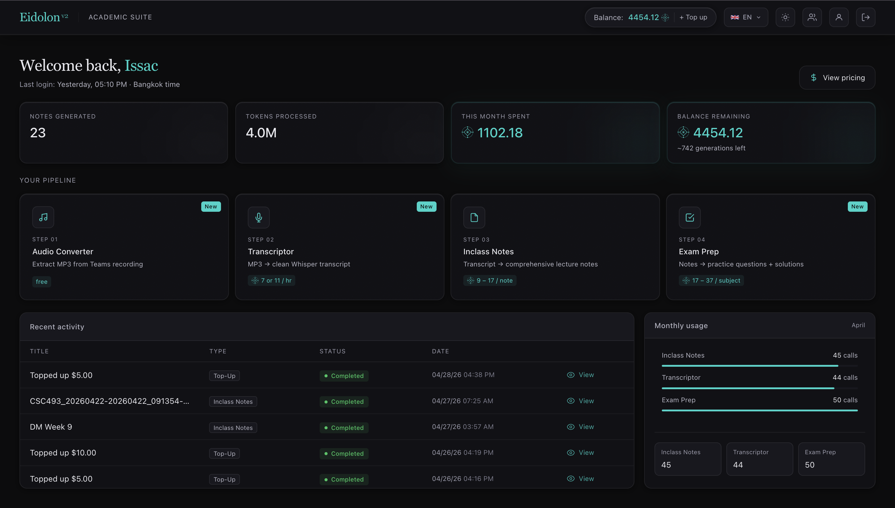

---

## Overview

Eidolon v2 is a full rewrite of the original platform. Every major subsystem has been replaced or significantly upgraded — from the database layer and authentication to the AI model stack and job queue infrastructure. The result is a faster, more scalable, and more capable platform designed to support a growing user base with real payment flows and collaborative features.

---

## What's New in v2

### Breaking Changes from v1
- **Database:** MySQL (PlanetScale) → **self-hosted PostgreSQL** on Hetzner VPS
- **Authentication:** Custom JWT/bcrypt → **Auth0 with Google OAuth only**
- **Queue infrastructure:** Upstash Redis → **self-hosted Redis** (BullMQ, same Hetzner box)
- **Storage:** Local filesystem → **Cloudflare R2** for all media files
- **Removed:** PDF export (Puppeteer), document generator, textbook explainer, BYOK

### New in v2
- **Exam Prep Generator** — structured practice questions from notes or transcripts, individual and group
- **Group Workspace System** — shared generation with cost splitting; membership snapshotted at generation time
- **Top-Up System** — credit-based balance with Stripe card payments (auto-credited instantly)
- **Admin Dashboard** — user management, activity logs, balance overview
- **Transcriptor** — async BullMQ processing via DeepInfra Whisper, chunked progress, history and detail views
- **Audio Converter** — multi-format extraction via FFmpeg, ephemeral by design (no DB persistence)
- **Profile & Activity History** — per-user usage stats, token consumption, charge breakdown, balance history

---

## Features

### Intelligent Note Taker

Transforms raw lecture transcripts into structured, study-ready Markdown notes. Three output styles: standard prose, textbook-format, and ultra-compact exam/cheat sheet. Supports individual and group generation with tiered pricing.

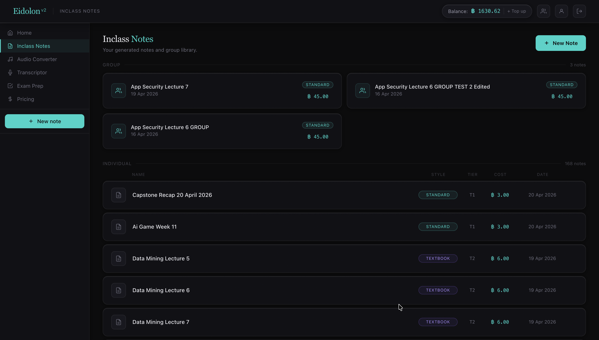

Configure the output style and source material before generation. Cost is estimated live based on input length and selected style.

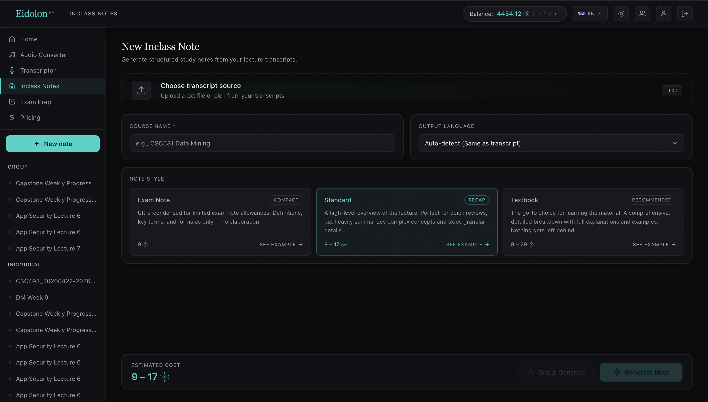

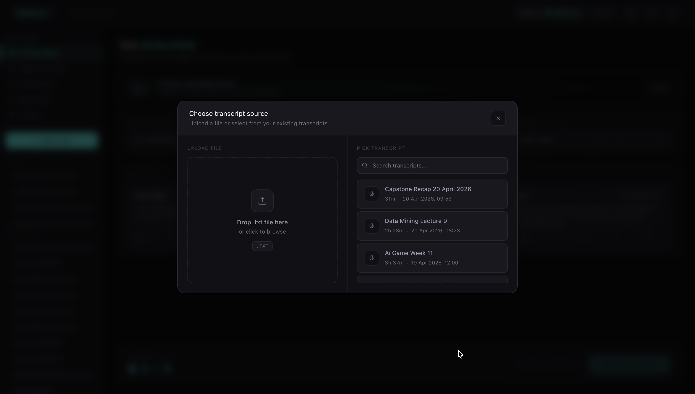

The generated note is rendered as structured Markdown with a detail sidebar, fullscreen mode, and inline editing.

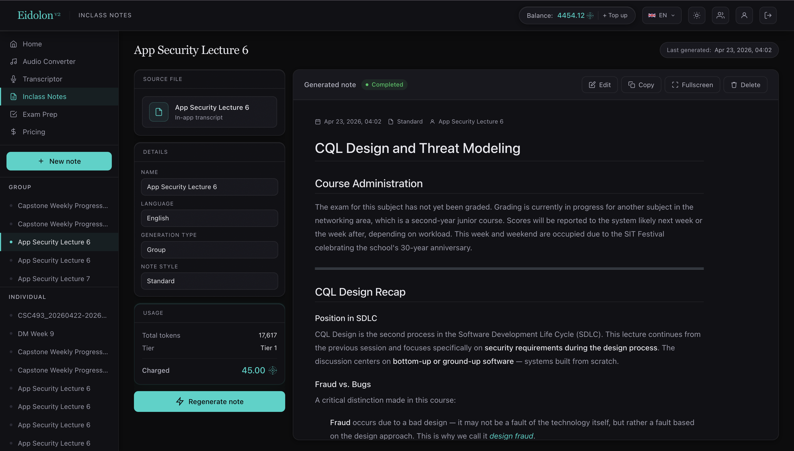

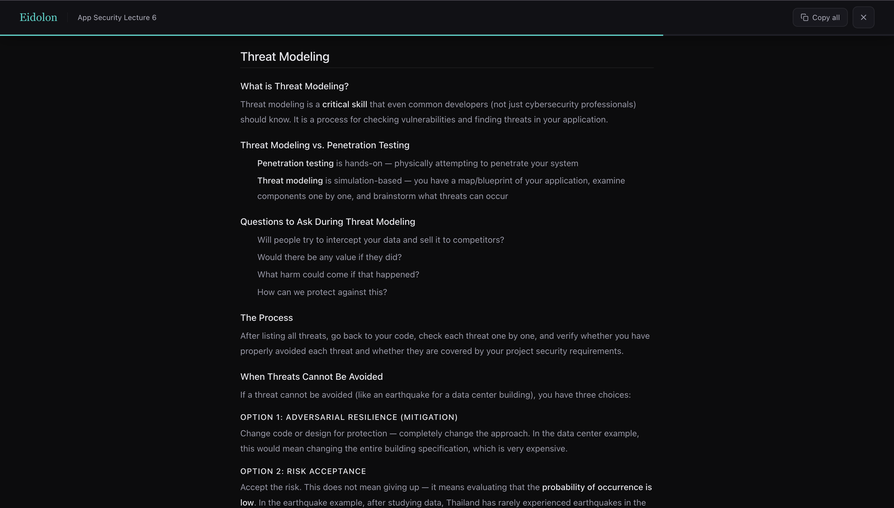

---

### Transcriptor

Uploads audio files and queues async transcription jobs via DeepInfra Whisper Large V3 / V3 Turbo. Supports files up to 500 MB and 10 hours of audio. Stores results with full history, optional timestamps, and chunk-based progress tracking.

Accepted formats: `.mp3`, `.wav`, `.m4a`, `.ogg`, `.flac`, `.aac`, `.webm`

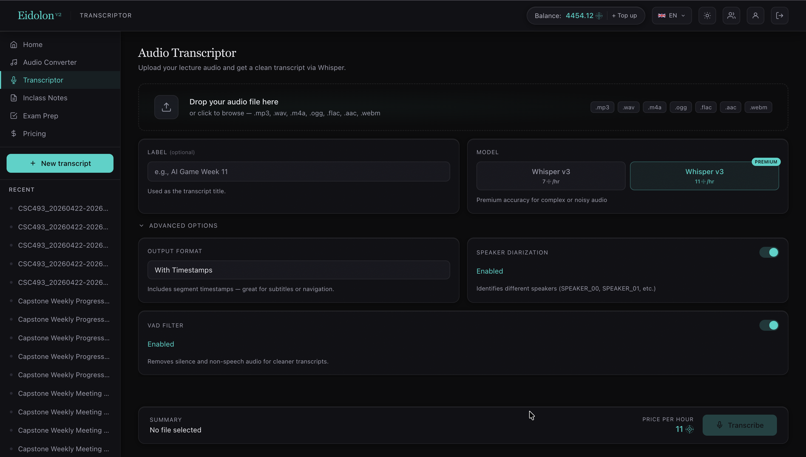

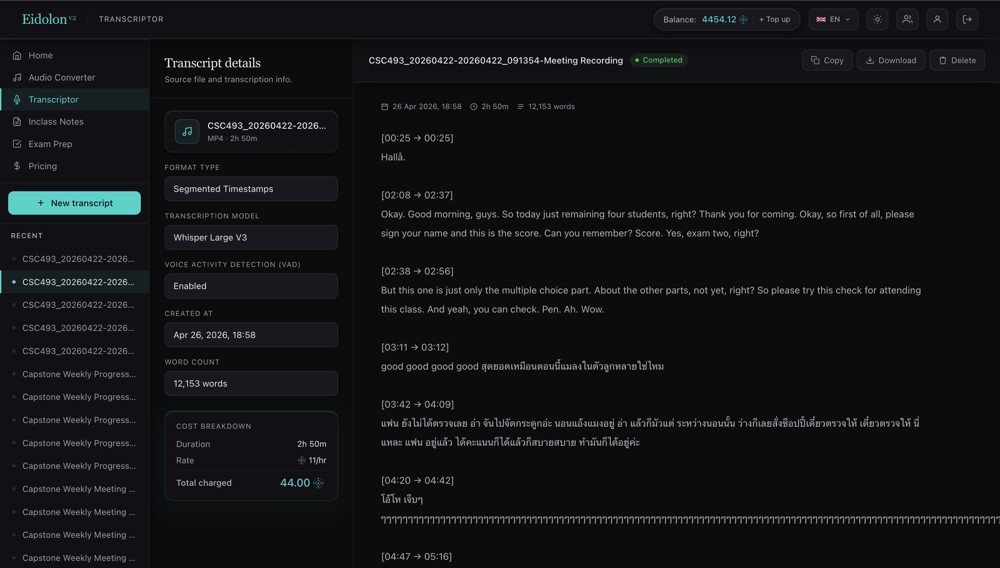

---

### Audio Converter

Stream-based audio extraction from video files using FFmpeg. Jobs are queued via BullMQ, processed asynchronously, and cleaned up automatically. No data is persisted to the database.

Accepted input: `.mp4`, `.mov`, `.mkv`, `.avi`, `.webm`  
Output formats: `MP3`, `WAV`, `M4A` — configurable bitrate and optional trim.

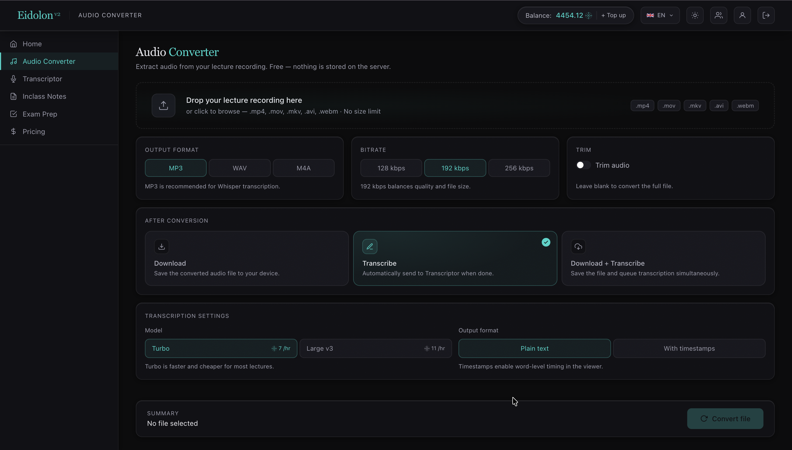

---

### Exam Prep Generator

Generates structured practice material from existing notes or transcripts. Fully configurable question types (True/False, MCQ, Theory, Scenario, Calculation) and difficulty levels. Available for both individual users and group workspaces with shared cost splitting.

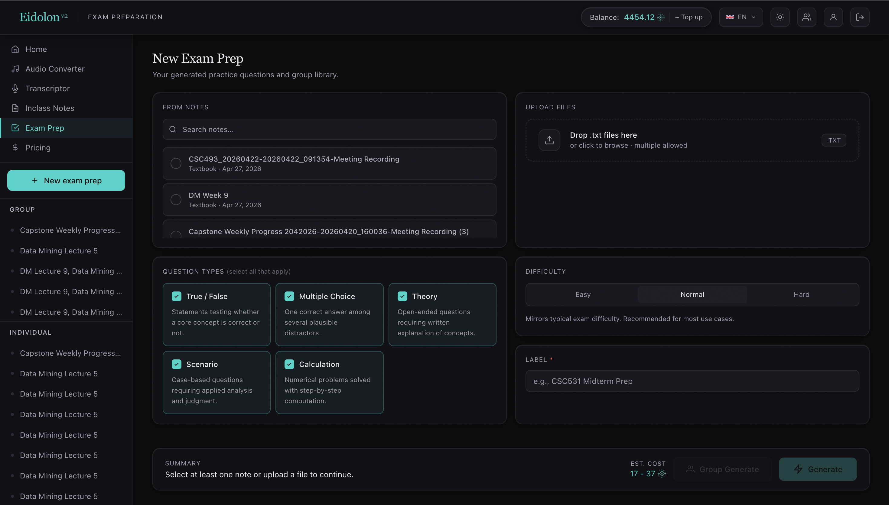

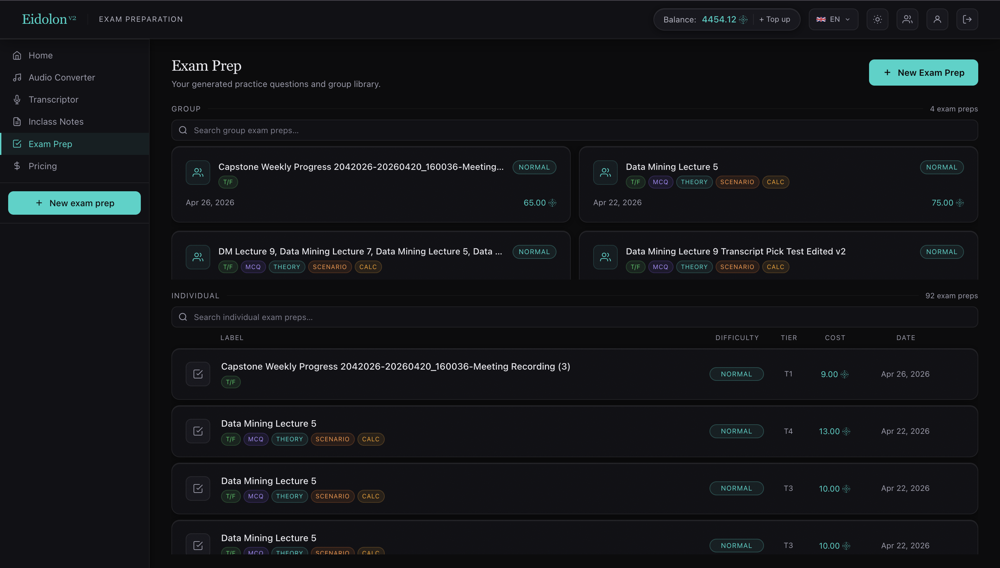

The viewer presents questions with a metadata sidebar on the left (details, configuration, sources) and a question panel on the right with individual solution reveal or global show/hide toggle.

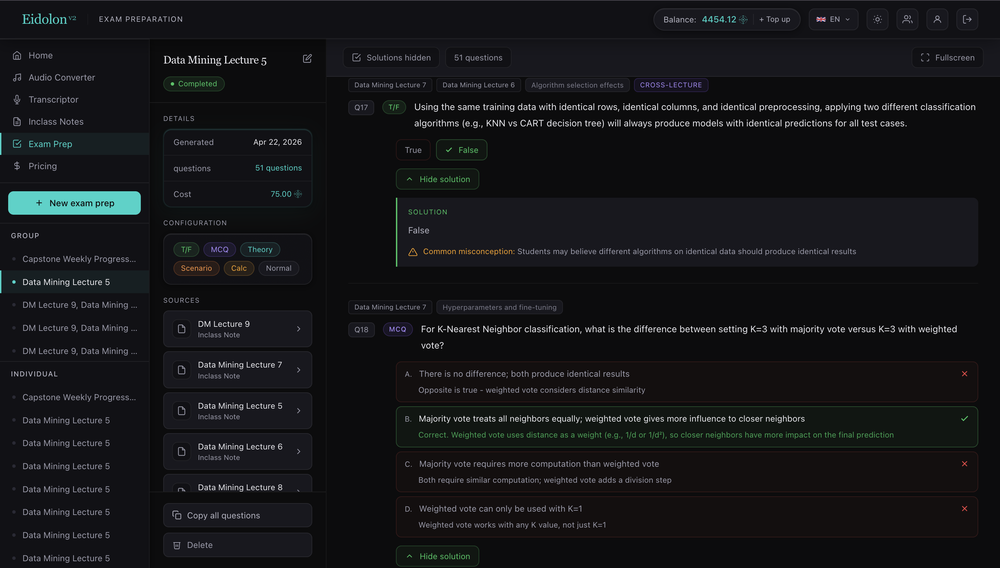

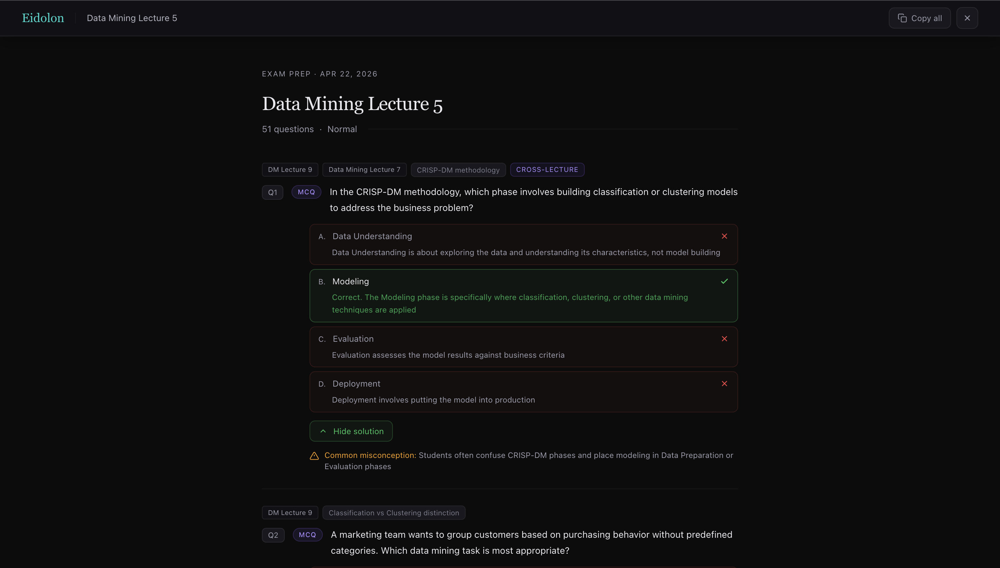

---

### Group Workspaces

Users can create and join groups with fixed-tier pricing (small / study / class / faculty). Costs are split across all members at generation time, with the generator receiving a 50% discount on their share. Membership is snapshotted at the time of generation.

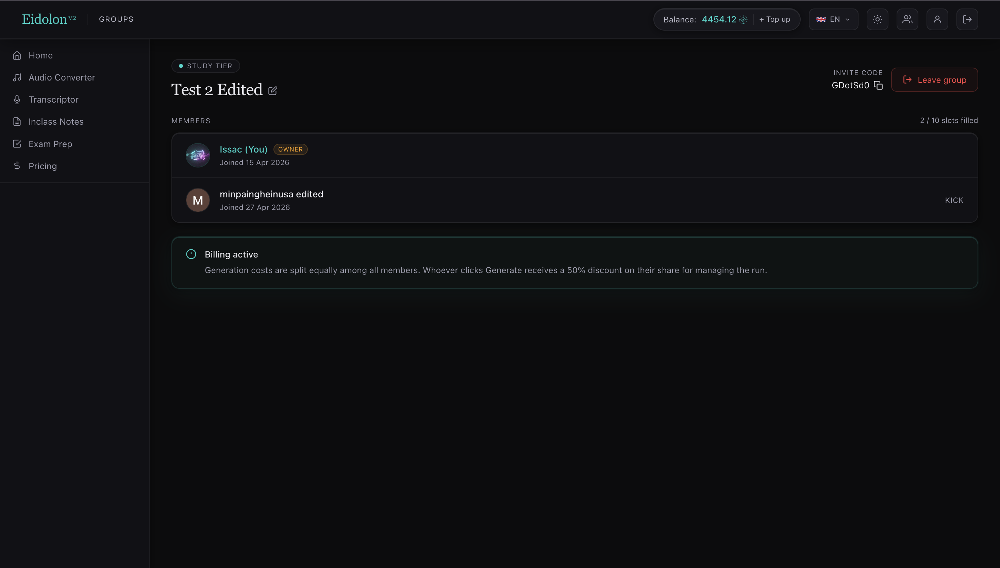

---

### Top-Up & Billing

Credit-based system. Users top up via Stripe card payment — credits are added instantly after payment confirmation. Packages available from $1.50 to $25, with a custom amount option.

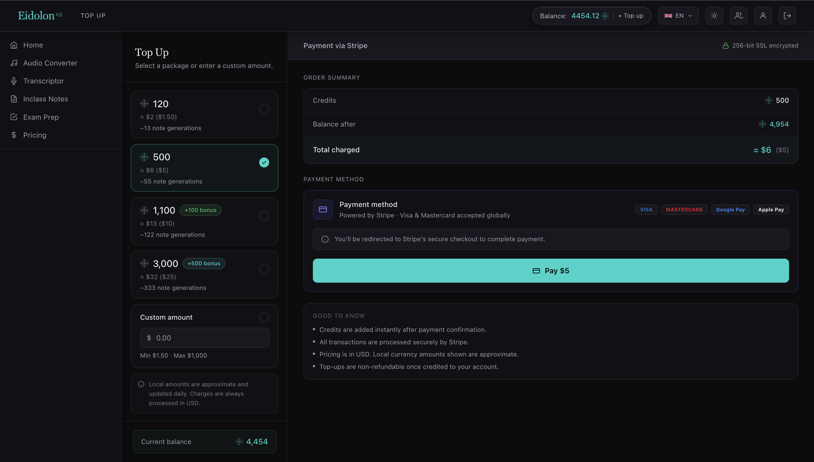

---

### Admin Dashboard

Full visibility into platform activity: user list, per-user balance and usage, and activity logs.

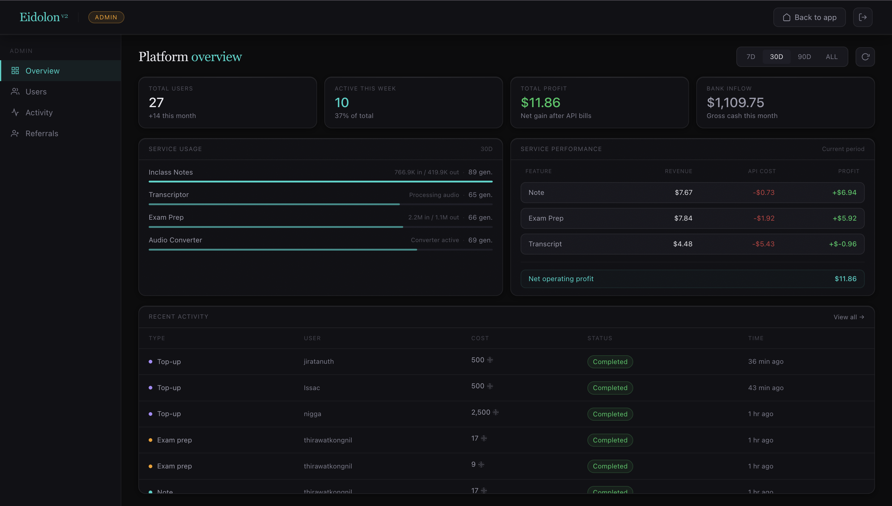

---

## Tech Stack

### Frontend
- **Framework:** Next.js 15 (App Router)
- **UI:** React 19, Tailwind CSS v4, Framer Motion / Motion
- **Editor:** `@uiw/react-md-editor`

### Backend
- **Runtime:** Node.js on Ubuntu 24.04 VPS
- **API:** Next.js API Routes
- **Database:** PostgreSQL (self-hosted, Hetzner CX22) via postgres.js
- **Queue:** BullMQ + self-hosted Redis
- **Storage:** Cloudflare R2 (converted audio files)
- **Auth:** Auth0 (Google OAuth)

### AI / ML
- **Notes generation:** Fireworks AI (model configurable via `NOTE_MODEL`)
- **Exam prep generation:** Fireworks AI (model configurable via `EXAM_MODEL`)
- **Transcription:** DeepInfra OpenAI-compatible speech API — Whisper Large V3 Turbo (fast) and Whisper Large V3 (premium)

### Payments
- **Stripe** — card payments, webhook-verified, idempotent credit crediting

### Infrastructure
- **VPS:** Hetzner (built-in DDoS protection, outbound-only bandwidth)
- **Web Server:** Nginx (reverse proxy, upload limit)
- **Process Manager:** PM2
- **Backups:** `pg_dump` cron → Cloudflare R2 (7-day retention)

---

## Architecture

```
Nginx (TLS termination, upload limit)
    └── Next.js App (port 3000)
            ├── API Routes (note, transcript, exam-prep, topup, admin, group)
            ├── Stripe Webhook Handler (instant credit crediting)
            └── BullMQ Producers
                    ├── audio-worker        (FFmpeg conversion, R2 upload)
                    └── transcriptor-worker (DeepInfra Whisper, chunked progress, cleanup)

Self-hosted Redis  ←→  BullMQ Workers
PostgreSQL (postgres.js)
Cloudflare R2 (converted audio dumps)
```

---

## Database Schema

Tables: `user`, `note`, `note_access`, `transcript`, `exam_prep`, `exam_prep_access`, `student_group`, `group_member`, `pending_topups`, `activity`, `audio_converter_logs`

Key design decisions:
- `activity` tracks token consumption, model used, charge amount, and `balance_after` for a full audit trail
- `note_access` and `exam_prep_access` snapshot group membership at generation time — changes to group size after the fact do not affect past cost splits
- `student_group` + `group_member` manage group tiers and membership; the generator's 50% discount is calculated at charge time

---

## Pricing

### Individual — Inclass Notes

| Tier | Token range | Credits |
|---|---|---|
| Tier 1 | < 25k tokens | 9 |
| Tier 2 | 25k – 50k tokens | 17 |
| Tier 3 | 50k – 75k tokens | 29 |
| Tier 4 | 75k – 100k tokens | 37 |

### Individual — Transcription

| Tier | Duration | Turbo | Premium |
|---|---|---|---|
| Tier 1 | < 1 hour | 2.4 | 5.4 |
| Tier 2 | 1 – 2 hours | 4.8 | 10.8 |
| Tier 3 | 2 – 3 hours | 7.2 | 16.2 |
| Tier 4 | 3+ hours | 2.4 / hr | 5.4 / hr |

### Credit Packages

| Price | Credits |
|---|---|
| $1.50 | 120 |
| $5.00 | 500 |
| $10.00 | 1,100 (+100 bonus) |
| $25.00 | 3,000 (+500 bonus) |

---

## License

Private / Proprietary.
Built for survival.
